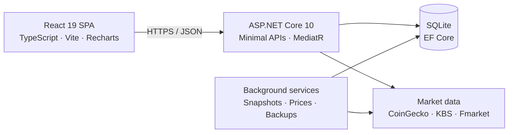

<div align="center">
  

  # CorePortfolio

  **A unified platform for personal wealth, transaction, and investment performance management.**

  Track crypto, Vietnamese equities, ETFs, and mutual funds; manage cash flow; analyze performance;<br/>
  automate market data updates; and operate the system through a secure administration control plane.

  [](https://dotnet.microsoft.com/)
  [](https://react.dev/)
  [](https://www.typescriptlang.org/)
  [](https://www.sqlite.org/)
  [](https://github.com/hieumt24/CorePortfolio/actions/workflows/backend-ci.yml)
  [](https://github.com/hieumt24/CorePortfolio/actions/workflows/frontend-ci.yml)
</div>

---

## Why CorePortfolio?

CorePortfolio brings together workflows that are usually scattered across spreadsheets, brokerage apps, and budgeting tools:

- Investment value, cost basis, realized/unrealized P&L, and asset allocation.
- A transaction ledger with CSV, XLS, and PDF import/export for Binance and OKX.
- Cash accounts, income and expenses, budgets, savings goals, and DCA plans.
- TWR, XIRR, drawdown, monthly returns, volatility, and benchmark analysis.
- Automated market data from CoinGecko, KBS, and Fmarket.
- User administration, permission management, auditing, backup/restore, and data integrity.

> Investment reports keep cash separate: current value and profit/loss reflect invested holdings only. Cash is managed independently and included only in the appropriate net-worth metrics.

## Highlights

| Area | Key capabilities |
| --- | --- |
| **Portfolio** | Multiple portfolios and asset classes, VND/USD conversion, weighted-average cost basis, and grouped P&L |
| **Transactions** | Server-side filters, pagination, crypto rewards, bulk deletion, import review, and polished exports |
| **Planning** | Cash accounts, cash flow, budgets, savings goals, DCA plans, and rebalancing suggestions/execution plans |
| **Analytics** | Financial Health, allocation, snapshots, TWR, XIRR, drawdown, heatmaps, and benchmarks |
| **Market data** | CoinGecko Top 100, KBS VN100/VN-Index/VN30, Fmarket fund NAV, caching, and stale-price fallback |
| **Admin & Ops** | RBAC, session security, audit trail, notifications, operations, data integrity, backups, and safety restore |

## Architecture



The backend follows **Vertical Slice Architecture**: endpoints, requests, and handlers are organized by feature under `CorePortfolio.API/Features`. User-owned data is always scoped to the current identity, and the API uses Minimal APIs rather than MVC controllers.

```text
CorePortfolio/
├── backend/src/
│   ├── CorePortfolio.API/             # Minimal APIs, MediatR slices, hosted services
│   ├── CorePortfolio.Domain/          # Entities, accounting, and performance rules
│   ├── CorePortfolio.Infrastructure/  # EF Core, SQLite, migrations
│   ├── CorePortfolio.Coingecko/       # Crypto market data
│   ├── CorePortfolio.KBS/             # Vietnamese equities, ETFs, and indices
│   ├── CorePortfolio.Fmarket/         # Mutual funds and NAV
│   └── CorePortfolio.Telegram/        # Telegram expense capture
├── frontend/src/                      # React feature modules and shared UI
├── docs/                              # Production and runbook documentation
└── .github/workflows/                 # Backend, frontend, encoding, and deployment CI
```

## Technology

**Backend:** .NET 10, ASP.NET Core Minimal APIs, MediatR, EF Core, SQLite, JWT, BCrypt, FluentValidation, and Swagger/OpenAPI.

**Frontend:** React 19, TypeScript 6, Vite 8, React Router, Recharts, Vitest, PDF.js, and SheetJS.

**Production:** Azure App Service, Vercel, GitHub Actions, SQLite online backup, and health/readiness probes.

## Local development

### Prerequisites

- [.NET SDK 10](https://dotnet.microsoft.com/download)
- [Node.js 20+](https://nodejs.org/) and npm
- Git

### 1. Clone and configure the backend

```powershell
git clone https://github.com/hieumt24/CorePortfolio.git
cd CorePortfolio

dotnet user-secrets set "Jwt:Key" "<a-long-random-secret>" `
  --project backend/src/CorePortfolio.API/CorePortfolio.API.csproj
dotnet user-secrets set "Jwt:Issuer" "CorePortfolio" `
  --project backend/src/CorePortfolio.API/CorePortfolio.API.csproj
dotnet user-secrets set "Jwt:Audience" "CorePortfolio.Client" `
  --project backend/src/CorePortfolio.API/CorePortfolio.API.csproj
```

CoinGecko and Telegram can be configured when needed. KBS and Fmarket do not require API keys.

### 2. Start the API

```powershell
dotnet run --project backend/src/CorePortfolio.API/CorePortfolio.API.csproj
```

The API runs at `http://localhost:5211` by default. In the Development environment:

- Swagger UI: `http://localhost:5211/swagger`
- Liveness: `http://localhost:5211/health/live`
- Readiness: `http://localhost:5211/health/ready`

EF Core applies migrations when the API starts. The local SQLite database is created as `CorePortfolio.db` by default.

### 3. Start the frontend

```powershell
cd frontend
npm install
npm run dev
```

Open `http://localhost:5173`. Vite proxies `/api` requests to the backend on port `5211`.

## Important configuration

Never commit secrets to `appsettings.json` or frontend code. Use .NET User Secrets during development and environment variables or a managed secret store in production.

| Setting | Purpose |
| --- | --- |
| `ConnectionStrings__DefaultConnection` | SQLite location; production Linux deployments should use persistent storage |
| `Jwt__Key`, `Jwt__Issuer`, `Jwt__Audience` | Access-token signing and validation |
| `Cors__AllowedOrigins__0` | Exact frontend origin allowlist |
| `VITE_API_URL` | Absolute API URL for production frontend builds |
| `CoinGecko__ApiKey` | Optional crypto market-data credential |
| `Telegram__BotToken` | Optional Telegram bot credential |
| `ForwardedHeaders__Enabled` | Enable when running behind a trusted reverse proxy |

## Testing and quality

```powershell
# Backend Release build
dotnet build backend/src/CorePortfolio.API/CorePortfolio.API.csproj -c Release

# Domain tests
dotnet test backend/src/CorePortfolio.Domain.Tests/CorePortfolio.Domain.Tests.csproj -c Release

# API integration tests
dotnet test backend/src/CorePortfolio.API.IntegrationTests/CorePortfolio.API.IntegrationTests.csproj -c Release

# Frontend tests and production build
cd frontend
npm test
npm run build
cd ..

# UTF-8 and mojibake guard
npm run check:encoding
```

CI also validates the EF migration snapshot, user isolation, transaction atomicity, authentication/authorization, and the production publish artifact.

## Security and operations

- Access tokens expire after 60 minutes; refresh tokens are hashed, stored in HttpOnly cookies, and rotated after every use.
- Sensitive endpoints use permission-based RBAC at both the HTTP and MediatR boundaries.
- Authentication endpoints are rate limited, and CORS accepts only explicitly allowlisted origins.
- SQLite backups use the online backup API, SHA-256 checksums, and `PRAGMA quick_check`.
- Restore operations require explicit confirmation, create a safety backup, and automatically roll back when validation fails.
- `/health/live` checks the process; `/health/ready` checks database connectivity and maintenance state.

## Production documentation

- [Project context and feature inventory](docs/PROJECT_CONTEXT.md)
- [Production hardening, backup, and recovery](docs/PRODUCTION_HARDENING.md)
- [Market data and secret handling](docs/PRODUCTION_MARKET_DATA.md)
- [Reverse proxy, client IP, and user presence](docs/PRODUCTION_USER_ACTIVITY.md)

## Disclaimer

CorePortfolio is currently a personal wealth-management project. Review the terms of CoinGecko, KBS, and Fmarket before using their data commercially. This software does not provide investment advice.
