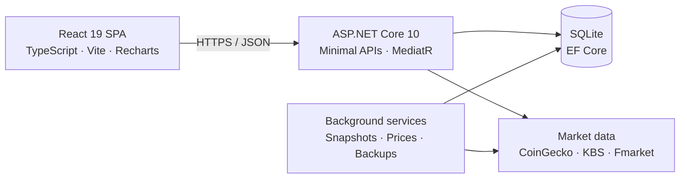

<div align="center">
  

  # CorePortfolio

  **Nền tảng quản lý tài sản cá nhân, giao dịch và hiệu suất đầu tư trong một trải nghiệm thống nhất.**

  Theo dõi Crypto, cổ phiếu Việt Nam, ETF và chứng chỉ quỹ; quản lý dòng tiền; phân tích hiệu suất;<br/>
  tự động cập nhật giá thị trường và vận hành hệ thống qua một control plane bảo mật.

  [](https://dotnet.microsoft.com/)
  [](https://react.dev/)
  [](https://www.typescriptlang.org/)
  [](https://www.sqlite.org/)
  [](https://github.com/hieumt24/CorePortfolio/actions/workflows/backend-ci.yml)
  [](https://github.com/hieumt24/CorePortfolio/actions/workflows/frontend-ci.yml)
</div>

---

## Vì sao có CorePortfolio?

CorePortfolio gom những phần thường bị tách rời giữa spreadsheet, ứng dụng giao dịch và công cụ quản lý chi tiêu vào một hệ thống duy nhất:

- Giá trị đầu tư, cost basis, realized/unrealized P&L và phân bổ tài sản.
- Sổ giao dịch có import/export CSV, XLS và PDF cho Binance/OKX.
- Tiền mặt, thu chi, ngân sách, mục tiêu tiết kiệm và kế hoạch DCA.
- TWR, XIRR, drawdown, monthly return, volatility và benchmark.
- Dữ liệu giá tự động từ CoinGecko, KBS và Fmarket.
- Quản trị người dùng, phân quyền, audit, backup/restore và data integrity.

> Báo cáo đầu tư tách biệt tiền mặt: giá trị hiện tại và lãi/lỗ chỉ phản ánh các khoản đã đầu tư. Cash vẫn được quản lý riêng và chỉ cộng vào các chỉ số net worth phù hợp.

## Điểm nổi bật

| Khu vực | Khả năng chính |
| --- | --- |
| **Portfolio** | Nhiều danh mục, nhiều loại tài sản, quy đổi VND/USD, cost basis bình quân và P&L theo nhóm |
| **Transactions** | Bộ lọc server-side, phân trang, Earn cho crypto, bulk delete, import review và export chuyên nghiệp |
| **Planning** | Cash account, cashflow, budget, saving goal, DCA plan, gợi ý và kế hoạch tái cân bằng |
| **Analytics** | Financial Health, allocation, snapshots, TWR, XIRR, drawdown, heatmap và benchmark |
| **Market data** | CoinGecko Top 100, KBS VN100/VN-Index/VN30, Fmarket fund NAV, cache và stale-price fallback |
| **Admin & Ops** | RBAC, session security, audit trail, notifications, operations, data integrity, backup và safety restore |

## Kiến trúc



Backend tuân theo **Vertical Slice Architecture**: endpoint, request và handler được đặt theo từng feature trong `CorePortfolio.API/Features`. Dữ liệu thuộc người dùng luôn được scope theo danh tính hiện tại; API không sử dụng MVC controller.

```text
CorePortfolio/
├── backend/src/
│   ├── CorePortfolio.API/             # Minimal APIs, MediatR slices, hosted services
│   ├── CorePortfolio.Domain/          # Entities, accounting và performance rules
│   ├── CorePortfolio.Infrastructure/  # EF Core, SQLite, migrations
│   ├── CorePortfolio.Coingecko/       # Crypto market data
│   ├── CorePortfolio.KBS/             # Cổ phiếu, ETF và chỉ số Việt Nam
│   ├── CorePortfolio.Fmarket/         # Quỹ mở và NAV
│   └── CorePortfolio.Telegram/        # Telegram expense capture
├── frontend/src/                      # React feature modules và shared UI
├── docs/                              # Production/runbook documentation
└── .github/workflows/                 # Backend, frontend, encoding và deployment CI
```

## Công nghệ

**Backend:** .NET 10, ASP.NET Core Minimal APIs, MediatR, EF Core, SQLite, JWT, BCrypt, FluentValidation, Swagger/OpenAPI.

**Frontend:** React 19, TypeScript 6, Vite 8, React Router, Recharts, Vitest, PDF.js và SheetJS.

**Production:** Azure App Service, Vercel, GitHub Actions, SQLite online backup, health/readiness probes.

## Chạy local

### Yêu cầu

- [.NET SDK 10](https://dotnet.microsoft.com/download)
- [Node.js 20+](https://nodejs.org/) và npm
- Git

### 1. Clone và cấu hình backend

```powershell
git clone https://github.com/hieumt24/CorePortfolio.git
cd CorePortfolio

dotnet user-secrets set "Jwt:Key" "<a-long-random-secret>" `
  --project backend/src/CorePortfolio.API/CorePortfolio.API.csproj
dotnet user-secrets set "Jwt:Issuer" "CorePortfolio" `
  --project backend/src/CorePortfolio.API/CorePortfolio.API.csproj
dotnet user-secrets set "Jwt:Audience" "CorePortfolio.Client" `
  --project backend/src/CorePortfolio.API/CorePortfolio.API.csproj
```

CoinGecko và Telegram có thể cấu hình thêm khi cần. KBS và Fmarket hoạt động không cần API key.

### 2. Khởi động API

```powershell
dotnet run --project backend/src/CorePortfolio.API/CorePortfolio.API.csproj
```

API mặc định chạy tại `http://localhost:5211`. Trong môi trường Development:

- Swagger UI: `http://localhost:5211/swagger`
- Liveness: `http://localhost:5211/health/live`
- Readiness: `http://localhost:5211/health/ready`

EF Core tự áp dụng migration khi API khởi động. SQLite local mặc định được tạo tại `CorePortfolio.db`.

### 3. Khởi động frontend

```powershell
cd frontend
npm install
npm run dev
```

Mở `http://localhost:5173`. Vite proxy các request `/api` sang backend tại port `5211`.

## Cấu hình quan trọng

Không commit secret vào `appsettings.json` hoặc frontend. Dùng .NET User Secrets khi phát triển và secret store/environment variables khi deploy.

| Setting | Mục đích |
| --- | --- |
| `ConnectionStrings__DefaultConnection` | Đường dẫn SQLite; production Linux nên dùng storage bền vững |
| `Jwt__Key`, `Jwt__Issuer`, `Jwt__Audience` | Ký và xác thực access token |
| `Cors__AllowedOrigins__0` | Allowlist frontend origin chính xác |
| `VITE_API_URL` | API URL tuyệt đối cho frontend production |
| `CoinGecko__ApiKey` | Tuỳ chọn cho market data crypto |
| `Telegram__BotToken` | Tuỳ chọn cho Telegram bot |
| `ForwardedHeaders__Enabled` | Bật khi API chạy sau reverse proxy đã tin cậy |

## Kiểm thử và chất lượng

```powershell
# Backend Release build
dotnet build backend/src/CorePortfolio.API/CorePortfolio.API.csproj -c Release

# Domain tests
dotnet test backend/src/CorePortfolio.Domain.Tests/CorePortfolio.Domain.Tests.csproj -c Release

# API integration tests
dotnet test backend/src/CorePortfolio.API.IntegrationTests/CorePortfolio.API.IntegrationTests.csproj -c Release

# Frontend tests + production build
cd frontend
npm test
npm run build
cd ..

# UTF-8 / mojibake guard
npm run check:encoding
```

CI còn kiểm tra migration snapshot, user isolation, transaction atomicity, authentication/authorization và production publish.

## Bảo mật và vận hành

- Access token sống 60 phút; refresh token được hash, đặt trong HttpOnly cookie và rotate sau mỗi lần dùng.
- Endpoint nhạy cảm được bảo vệ bằng permission-based RBAC ở cả HTTP và MediatR boundary.
- Auth endpoints có rate limiting; CORS chỉ chấp nhận origin nằm trong allowlist.
- Backup SQLite dùng online backup, SHA-256 và `PRAGMA quick_check`.
- Restore yêu cầu xác nhận, tạo safety backup và tự rollback nếu validation thất bại.
- `/health/live` kiểm tra process; `/health/ready` kiểm tra database và maintenance state.

## Tài liệu production

- [Project context và feature inventory](docs/PROJECT_CONTEXT.md)
- [Production hardening, backup và recovery](docs/PRODUCTION_HARDENING.md)
- [Market data và secret handling](docs/PRODUCTION_MARKET_DATA.md)
- [Reverse proxy, client IP và user presence](docs/PRODUCTION_USER_ACTIVITY.md)

## Lưu ý

CorePortfolio hiện là dự án quản lý tài sản phục vụ mục đích cá nhân. Hãy đánh giá lại điều khoản của CoinGecko, KBS và Fmarket trước khi sử dụng dữ liệu cho mục đích thương mại. Phần mềm không cung cấp lời khuyên đầu tư.
